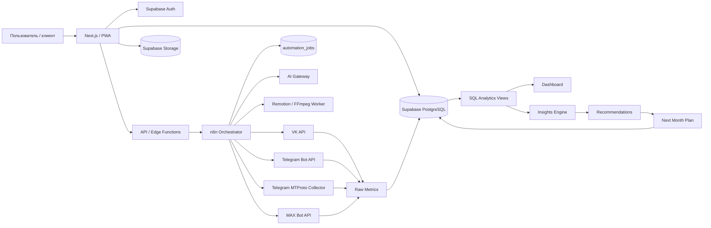
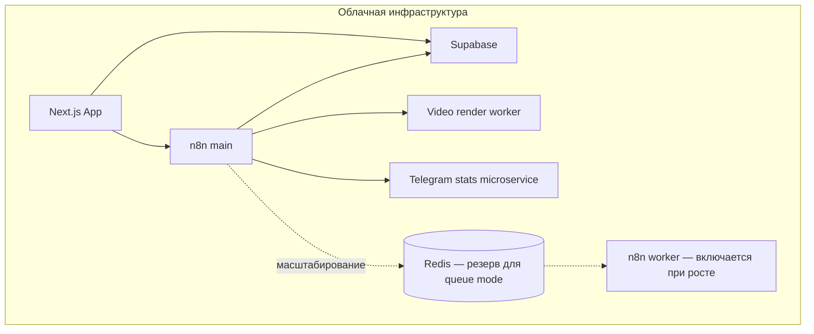
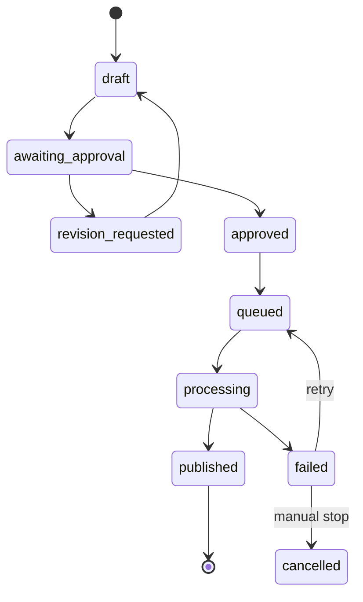

# MARIA SMM OS
## Архитектура MVP

Версия: 1.0  
Дата: 10.07.2026

---

## 1. Архитектурный принцип

MARIA SMM OS строится как замкнутый операционный контур:

```text
Стратегия
  → Контент-план
  → Производство текста/визуала/видео
  → Согласование
  → Очередь публикаций
  → Публикация
  → Сбор метрик
  → Нормализация
  → Аналитика
  → Рекомендации
  → Контент-план следующего месяца
```

Ключевой объект системы — не пост, а связка:

```text
Контентная гипотеза
  + признаки материала
  + канал
  + публикация
  + временные срезы метрик
  + итоговый вывод
```

---

## 2. Контуры системы

### 2.1. Пользовательский контур

- Next.js web application;
- responsive-интерфейс;
- PWA для работы со смартфона;
- Supabase Auth;
- роли на уровне рабочего пространства;
- real-time обновление статусов публикации и генерации.

### 2.2. Контур данных

- Supabase PostgreSQL — основная операционная база;
- Supabase Storage — медиатека;
- Row Level Security — изоляция рабочих пространств;
- SQL views/materialized views — аналитические витрины;
- ежедневные и постовые исторические snapshots;
- журнал действий и журнал интеграционных ошибок.

### 2.3. Контур автоматизации

- n8n — оркестрация процессов;
- webhook-входы из приложения;
- schedule-trigger для периодических задач;
- отдельные sub-workflow по каждой площадке;
- единый error workflow;
- idempotency key для защиты от двойной публикации;
- retry с экспоненциальной задержкой;
- dead-letter очередь в таблице `automation_jobs`.

### 2.4. Контур интеграций

- VK API;
- Telegram Bot API — публикация;
- отдельный Telegram MTProto collector — расширенная статистика;
- MAX Bot API;
- AI Gateway;
- сервис шаблонного видео;
- уведомления пользователю.

### 2.5. Аналитический контур

- сбор исходных метрик;
- сохранение raw payload;
- преобразование в единую модель;
- расчёт производных показателей;
- нормализация по каналу и формату;
- формирование insight;
- генерация recommendation;
- проект контент-плана следующего месяца.

---

## 3. Логическая схема



---

## 4. Физическая топология MVP



### MVP-развёртывание

На старте допустимо:

- один экземпляр n8n;
- PostgreSQL Supabase;
- отдельный небольшой контейнер Telegram MTProto;
- отдельный контейнер Remotion/FFmpeg;
- объектное хранилище Supabase Storage.

### Переход к production-scale

При увеличении количества проектов:

- n8n queue mode;
- Redis;
- несколько n8n workers;
- отдельные очереди публикации, аналитики и рендеринга;
- S3-совместимое внешнее хранение бинарных данных;
- мониторинг очередей и ошибок.

---

## 5. Границы ответственности

| Компонент | Ответственность |
|---|---|
| Next.js | интерфейс, валидация формы, отображение данных |
| Supabase Auth | аутентификация |
| PostgreSQL | бизнес-состояние, права, история, метрики |
| Storage | исходники и готовые медиафайлы |
| Edge/API layer | безопасные операции, запуск n8n, выдача signed URL |
| n8n | оркестрация и интеграции |
| AI Gateway | единая точка вызова LLM/image/video providers |
| Video worker | детерминированная сборка роликов |
| Telegram collector | MTProto-сессия и статистика |
| SQL analytics layer | вычисляемые показатели и витрины |
| AI insight workflow | интерпретация уже рассчитанных показателей |

---

## 6. Модель доступа

### Роли

1. `owner`
2. `admin`
3. `smm`
4. `editor`
5. `approver`
6. `viewer`

### Матрица

| Действие | owner | admin | smm | editor | approver | viewer |
|---|:---:|:---:|:---:|:---:|:---:|:---:|
| Настройки workspace | ✓ | ✓ | — | — | — | — |
| Подключение каналов | ✓ | ✓ | — | — | — | — |
| Создание контента | ✓ | ✓ | ✓ | ✓ | — | — |
| Редактирование визуала | ✓ | ✓ | ✓ | ✓ | — | — |
| Согласование | ✓ | ✓ | ✓ | — | ✓ | — |
| Постановка в публикацию | ✓ | ✓ | ✓ | — | — | — |
| Просмотр аналитики | ✓ | ✓ | ✓ | ✓ | ✓ | ✓ |
| Управление пользователями | ✓ | ✓ | — | — | — | — |

### Защита секретов

В публичной схеме хранится только:

- тип подключения;
- статус;
- срок действия;
- `secret_ref`;
- диагностическая информация.

API-токены и MTProto-session не выдаются браузеру. Они находятся:

- в Supabase Vault;
- либо в защищённом secret manager;
- либо в credentials n8n;
- либо в закрытом сервисе Telegram collector.

---

## 7. Жизненный цикл публикации



### Условия публикации

Публикация разрешена только если:

- вариант контента имеет статус `approved`;
- канал активен;
- подключение прошло health-check;
- есть обязательный текст/медиа;
- время публикации не в прошлом либо разрешена немедленная публикация;
- `idempotency_key` уникален;
- отсутствует опубликованный внешний ID.

---

## 8. Идемпотентность

Ключ публикации:

```text
sha256(
  workspace_id
  + channel_id
  + content_variant_id
  + scheduled_at
  + version_no
)
```

Перед отправкой workflow обязан:

1. заблокировать запись публикации;
2. проверить `external_post_id`;
3. проверить существующий успешный attempt;
4. увеличить `attempt_count`;
5. после ответа площадки сохранить внешний ID и URL;
6. при сетевой неопределённости сначала выполнить reconciliation, а не повторную отправку вслепую.

---

## 9. Сбор метрик

### Канальные snapshots

Один основной срез в сутки по локальному времени проекта:

- followers;
- subscriptions;
- unsubscriptions;
- reach;
- impressions;
- views;
- reactions;
- comments;
- shares;
- clicks;
- posts_count.

### Срезы публикации

- `1h`;
- `6h`;
- `24h`;
- `72h`;
- `7d`;
- `30d`;
- дополнительный `daily` при необходимости.

### Обязательная модель хранения

Хранятся одновременно:

1. нормализованные поля;
2. `raw_payload` площадки;
3. время получения;
4. область данных: organic / paid / combined;
5. версия коннектора.

---

## 10. Аналитические слои

### Layer 1. Raw

Исходные ответы API.

### Layer 2. Normalized

Единые поля по всем площадкам.

### Layer 3. Derived

- ER;
- growth rate;
- share rate;
- viral share;
- velocity;
- content score;
- отклонение от медианы;
- рейтинг рубрики;
- рейтинг формата.

### Layer 4. Insight

Формализованные выводы с доказательной базой.

### Layer 5. Recommendation

Рекомендации с:

- действием;
- обоснованием;
- метрикой;
- уровнем уверенности;
- сроком проверки;
- связанной гипотезой.

---

## 11. Расчёт Content Score

Для MVP:

```text
Content Score =
  0.30 × percentile(reach_or_views)
+ 0.25 × percentile(engagement_rate)
+ 0.20 × percentile(share_rate)
+ 0.15 × percentile(velocity_24h)
+ 0.10 × percentile(click_rate)
```

Правила:

- расчёт внутри одного канала;
- отдельная нормализация по формату;
- окно сравнения — 90 дней;
- минимум 10 сопоставимых публикаций;
- при недостатке данных показывается provisional score;
- веса настраиваются на уровне бренда.

---

## 12. Контур рекомендаций

AI не получает задачу «проанализируй сырые цифры». Он получает JSON:

```json
{
  "period": "2026-06",
  "sample_size": 18,
  "channel_baselines": {},
  "rubric_performance": [],
  "format_performance": [],
  "time_performance": [],
  "top_posts": [],
  "weak_posts": [],
  "anomalies": [],
  "statistical_limits": []
}
```

На выходе требуется строгая структура:

```json
{
  "summary": "",
  "recommendations": [
    {
      "action": "",
      "reason": "",
      "evidence": [],
      "confidence": "high|medium|low|insufficient",
      "test_metric": "",
      "test_period_days": 30
    }
  ]
}
```

---

## 13. Обязательные API приложения

| Method | Endpoint | Назначение |
|---|---|---|
| POST | `/api/workspaces` | создать workspace |
| POST | `/api/brands` | создать бренд |
| POST | `/api/channels/connect` | инициировать подключение |
| POST | `/api/content/generate` | генерация текста |
| POST | `/api/assets/generate` | генерация изображения |
| POST | `/api/video/render` | постановка рендера |
| POST | `/api/approvals/request` | запрос согласования |
| POST | `/api/publications/schedule` | постановка публикации |
| POST | `/api/publications/cancel` | отмена |
| POST | `/api/analytics/sync` | ручная синхронизация |
| POST | `/api/reports/generate` | отчёт |
| POST | `/api/plans/generate` | план следующего месяца |
| GET | `/api/jobs/:id` | статус фоновой задачи |

---

## 14. События системы

- `content.created`
- `content.updated`
- `content.approval_requested`
- `content.approved`
- `content.revision_requested`
- `publication.queued`
- `publication.started`
- `publication.succeeded`
- `publication.failed`
- `metrics.channel_collected`
- `metrics.post_collected`
- `analytics.period_closed`
- `report.generated`
- `recommendation.generated`
- `integration.expiring`
- `integration.failed`

События сохраняются в audit log и могут запускать n8n webhook.

---

## 15. Критические ограничения площадок

### Telegram

- Bot API используется для публикации;
- расширенная статистика каналов требует отдельного MTProto-контура;
- bot token и MTProto session разделены;
- статистика доступна только при наличии прав и доступности статистики для канала.

### MAX

- публикация реализуется через Bot API;
- медиа загружается отдельным шагом;
- набор доступной аналитики должен определяться capability-check;
- недоступные показатели отображаются как `null`, не как `0`;
- коннектор не должен предполагать наличие метода списка каналов;
- канал привязывается через явный `chat_id` или событие добавления бота.

### VK

- публикация и аналитика выполняются отдельными sub-workflow;
- необходимо хранить owner/group identifier и тип токена;
- лимиты и ошибки API обрабатываются централизованно.

---

## 16. Решения, которые нельзя откладывать

1. Все таблицы проектных данных содержат `workspace_id`.
2. Все клиентские таблицы закрыты RLS.
3. Секреты не хранятся в обычной публичной таблице.
4. Каждая публикация имеет idempotency key.
5. Каждый ответ API сохраняется как raw payload.
6. Невозможная метрика хранится как `NULL`.
7. Рекомендация содержит evidence и confidence.
8. Генерация не запускает публикацию автоматически.
9. Аналитика отделена от LLM-интерпретации.
10. Канальные коннекторы изолированы друг от друга.

---

## 17. Порядок реализации

### Sprint 1

- Auth;
- workspace;
- роли;
- бренды;
- каналы;
- базовый UI;
- RLS.

### Sprint 2

- контент-календарь;
- варианты;
- медиатека;
- согласование.

### Sprint 3

- очередь публикаций;
- Telegram;
- VK;
- MAX;
- error/retry/reconciliation.

### Sprint 4

- snapshots;
- аналитические views;
- дашборд.

### Sprint 5

- AI generation;
- image generation;
- video templates.

### Sprint 6

- monthly report;
- insights;
- recommendations;
- next-month plan.

---

## 18. Definition of Done MVP

MVP готов, когда один пользователь может:

- создать два независимых рабочих пространства;
- подключить минимум по одному каналу каждой поддерживаемой площадки;
- создать единый контент и три адаптации;
- согласовать одну конкретную версию;
- поставить публикации в очередь;
- получить внешние ID;
- пережить временную ошибку без дубля;
- увидеть snapshots;
- сравнить каналы;
- получить месячный вывод;
- сгенерировать проект плана следующего месяца.
