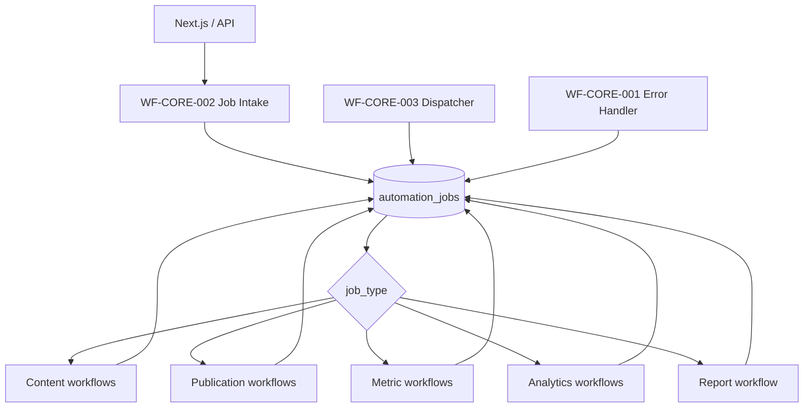

# MARIA SMM OS
## Реестр n8n-workflow для MVP

Версия: 1.0  
Дата: 10.07.2026

---

## 1. Состав

- **CORE:** 3 workflow
- **CONTENT:** 4 workflow
- **APPROVAL:** 2 workflow
- **PUBLICATION:** 5 workflow
- **METRICS:** 8 workflow
- **ANALYTICS:** 5 workflow
- **REPORT:** 1 workflow
- **OPS:** 4 workflow

Всего: **32 workflow**, из них обязательных для MVP: **31**.

---

## 2. Соглашения

### Имена

```text
WF-<GROUP>-<NUMBER> — <Human readable name>
```

### Общий контракт job

```json
{
  "job_id": "uuid",
  "workspace_id": "uuid",
  "job_type": "string",
  "entity_type": "string",
  "entity_id": "uuid",
  "idempotency_key": "string",
  "payload": {}
}
```

### Обязательные execution fields

- `job_id`;
- `workspace_id`;
- `workflow_code`;
- `entity_id`;
- `request_id`;
- `attempt_no`.

### Запреты

- не сохранять токены в execution data;
- не передавать service role key из браузера;
- не делать повторную публикацию после timeout без reconciliation;
- не считать `NULL` нулём;
- не использовать AI Agent для детерминированных API-операций;
- не смешивать разные платформы в одном publisher workflow.

### Retry policy

| Ошибка | Поведение |
|---|---|
| 400 / validation | без retry, manual correction |
| 401 / 403 | connection=expired/error, уведомление |
| 404 | reconciliation или invalid external id |
| 409 | проверить идемпотентность |
| 429 | retry по Retry-After |
| 500–599 | exponential retry |
| timeout | reconciliation перед retry |
| provider content rejection | без автоматического retry |

Рекомендуемые интервалы:

```text
1 минута → 5 минут → 20 минут → 1 час → manual review
```

---

## 3. Общая схема вызовов



---

## 4. Workflow-каталог


# Группа CORE

## WF-CORE-001 — Global Error Handler

**Группа:** CORE  
**Приоритет:** MVP  
**Trigger:** Error Trigger  
**Вход:** `workflow`, `execution`, `error`  
**Выход:** `error persisted`, `retry scheduled or dead-letter`

### Шаги

1. Нормализовать ошибку.
2. Определить workspace_id и entity_id из execution data.
3. Записать failure в automation_jobs/publication_attempts.
4. Рассчитать retry policy.
5. Создать notification.
6. Отправить техническое уведомление владельцу.

### Особые условия

Назначается error workflow для всех production workflows.

## WF-CORE-002 — Automation Job Intake

**Группа:** CORE  
**Приоритет:** MVP  
**Trigger:** Webhook POST /smm-os/jobs  
**Вход:** `workspace_id`, `job_type`, `entity_type`, `entity_id`, `payload`, `idempotency_key`  
**Выход:** `job_id`, `status`

### Шаги

1. Проверить HMAC/service token.
2. Проверить обязательные поля.
3. Upsert automation_jobs по idempotency_key.
4. Вернуть job_id и текущий status.

### Особые условия

Webhook отвечает быстро; тяжёлая работа выполняется асинхронно.

## WF-CORE-003 — Automation Job Dispatcher

**Группа:** CORE  
**Приоритет:** MVP  
**Trigger:** Schedule Trigger every minute  
**Вход:** `pending automation_jobs`  
**Выход:** `processed jobs`

### Шаги

1. Claim jobs через SELECT ... FOR UPDATE SKIP LOCKED / RPC.
2. Разделить по job_type.
3. Вызвать соответствующий sub-workflow.
4. Обновить result/status.
5. Освободить lock.

### Особые условия

Страхует систему от потерянных webhook и перезапуска n8n.


# Группа CONTENT

## WF-CONTENT-001 — Generate Content Copy

**Группа:** CONTENT  
**Приоритет:** MVP  
**Trigger:** Execute Sub-workflow: job_type=generate_copy  
**Вход:** `brand_id`, `content_item_id`, `target_channels`, `generation_options`  
**Выход:** `content_variant_ids`

### Шаги

1. Загрузить brand_profile и релевантные прошлые материалы.
2. Загрузить цель, рубрику и формат.
3. Собрать versioned prompt.
4. Вызвать AI Gateway.
5. Проверить Structured Output.
6. Проверить запрещённые фразы.
7. Создать content_variants.
8. Сохранить provider/model/token metadata.

### Особые условия

Никогда не переводит материал в approved автоматически.

## WF-CONTENT-002 — Generate Image

**Группа:** CONTENT  
**Приоритет:** MVP  
**Trigger:** Execute Sub-workflow: job_type=generate_image  
**Вход:** `brand_id`, `content_variant_id`, `prompt`, `dimensions`, `provider`  
**Выход:** `asset_ids`

### Шаги

1. Загрузить визуальные правила бренда.
2. Сформировать provider-neutral request.
3. Вызвать image provider через AI Gateway.
4. Скачать результат.
5. Проверить MIME, размер и checksum.
6. Загрузить в Storage.
7. Создать assets и content_assets.

### Особые условия

Провайдер выбирается настройкой, а не логикой workflow.

## WF-CONTENT-003 — Render Short Video

**Группа:** CONTENT  
**Приоритет:** MVP  
**Trigger:** Execute Sub-workflow: job_type=render_video  
**Вход:** `template_id`, `content_variant_id`, `asset_ids`, `render_options`  
**Выход:** `video_asset_id`, `thumbnail_asset_id`

### Шаги

1. Проверить шаблон и медиа.
2. Сформировать render manifest.
3. Вызвать Remotion/FFmpeg worker.
4. Опросить render status.
5. Загрузить MP4 и thumbnail в Storage.
6. Создать assets.
7. Закрыть job.

### Особые условия

Генеративное text-to-video подключается отдельным provider workflow.

## WF-ASSET-001 — Asset Post-processing

**Группа:** CONTENT  
**Приоритет:** MVP  
**Trigger:** Execute Sub-workflow: job_type=process_asset  
**Вход:** `asset_id`, `required_variants`  
**Выход:** `derived_asset_ids`

### Шаги

1. Получить signed source URL.
2. Определить размеры и длительность.
3. Создать crop/resize/thumbnail.
4. Посчитать checksum.
5. Сохранить производные assets.
6. Обновить metadata.

### Особые условия

Не хранить временные бинарные файлы в execution history.


# Группа APPROVAL

## WF-APPROVAL-001 — Request Approval

**Группа:** APPROVAL  
**Приоритет:** MVP  
**Trigger:** Webhook or job_type=request_approval  
**Вход:** `content_variant_id`, `approver_user_id`, `version_no`  
**Выход:** `approval_id`

### Шаги

1. Проверить, что версия существует.
2. Отменить устаревшие pending approvals.
3. Создать approvals.
4. Перевести variant в awaiting_approval.
5. Создать notification.
6. Отправить ссылку согласующему.

### Особые условия

Согласование привязано к конкретному version_no.

## WF-APPROVAL-002 — Approval Decision

**Группа:** APPROVAL  
**Приоритет:** MVP  
**Trigger:** Database/Webhook event after approval update  
**Вход:** `approval_id`, `decision`  
**Выход:** `new content status`

### Шаги

1. Проверить пользователя и версию.
2. При approved обновить content_variant/content_item.
3. При rejected установить revision_requested.
4. Записать audit event.
5. Уведомить ответственного.

### Особые условия

Устаревшую версию нельзя согласовать после создания новой.


# Группа PUBLICATION

## WF-PUB-001 — Publication Scheduler and Dispatcher

**Группа:** PUBLICATION  
**Приоритет:** MVP  
**Trigger:** Schedule Trigger every minute + manual webhook  
**Вход:** `queued publications due now`  
**Выход:** `platform workflow result`

### Шаги

1. Выбрать due publications.
2. Захватить lock.
3. Проверить approved version.
4. Проверить channel/connection health.
5. Проверить idempotency и external_post_id.
6. Создать publication_attempt.
7. Маршрутизировать по platform.
8. Запустить reconciliation при неопределённом результате.

### Особые условия

Не делает blind retry после timeout.

## WF-PUB-002 — Publish to VK

**Группа:** PUBLICATION  
**Приоритет:** MVP  
**Trigger:** Execute Sub-workflow from dispatcher  
**Вход:** `publication_id`  
**Выход:** `external_post_id`, `external_url`

### Шаги

1. Получить content variant, assets и connection.
2. Получить server-side secret.
3. Загрузить медиа по требованиям VK.
4. Собрать wall payload.
5. Вызвать VK API.
6. Сохранить post_id и public URL.
7. Установить published.
8. Создать snapshot jobs.

### Особые условия

Payload и API response сохраняются в publication_attempts.

## WF-PUB-003 — Publish to Telegram

**Группа:** PUBLICATION  
**Приоритет:** MVP  
**Trigger:** Execute Sub-workflow from dispatcher  
**Вход:** `publication_id`  
**Выход:** `message_id`, `external_url`

### Шаги

1. Получить bot token server-side.
2. Выбрать sendMessage/sendPhoto/sendVideo/sendMediaGroup.
3. Проверить длину caption и formatting.
4. Отправить материал.
5. Сохранить message_id и URL.
6. Установить published.
7. Создать snapshot jobs.

### Особые условия

Bot должен иметь право публикации в канале.

## WF-PUB-004 — Publish to MAX

**Группа:** PUBLICATION  
**Приоритет:** MVP  
**Trigger:** Execute Sub-workflow from dispatcher  
**Вход:** `publication_id`  
**Выход:** `message_id`, `external_url`

### Шаги

1. Получить MAX token server-side.
2. Проверить capability канала.
3. Для видео/файла получить upload URL/token.
4. Загрузить медиа.
5. Вызвать POST messages.
6. Сохранить mid и доступный URL.
7. Установить published.
8. Создать snapshot jobs.

### Особые условия

Base URL задаётся переменной окружения и не зашивается в workflow.

## WF-PUB-005 — Publication Reconciliation

**Группа:** PUBLICATION  
**Приоритет:** MVP  
**Trigger:** job_type=reconcile_publication  
**Вход:** `publication_id`, `last_attempt_id`  
**Выход:** `published|retry|manual_review`

### Шаги

1. Получить request fingerprint.
2. Проверить внешний пост по ID или доступному журналу.
3. При найденном посте закрыть publication как published.
4. При доказанном отсутствии вернуть queued.
5. При неопределённости отправить на manual review.

### Особые условия

Критическая защита от дублей.


# Группа METRICS

## WF-METRIC-001 — Daily Channel Metrics Dispatcher

**Группа:** METRICS  
**Приоритет:** MVP  
**Trigger:** Schedule Trigger hourly  
**Вход:** `active channels`  
**Выход:** `metric jobs`

### Шаги

1. Определить локальное время каждого канала.
2. Выбрать каналы без snapshot за текущую local_date.
3. Создать metric jobs.
4. Маршрутизировать по platform.

### Особые условия

Почасовой диспетчер корректно работает с разными часовыми поясами.

## WF-METRIC-002 — Collect VK Channel Metrics

**Группа:** METRICS  
**Приоритет:** MVP  
**Trigger:** Execute Sub-workflow  
**Вход:** `channel_id`, `local_date`  
**Выход:** `channel snapshot id`

### Шаги

1. Проверить токен.
2. Получить доступные channel/community metrics.
3. Сохранить raw payload.
4. Нормализовать поля.
5. Upsert channel_metric_snapshots.
6. Обновить last_successful_sync_at.

### Особые условия

Недоступные значения записываются NULL.

## WF-METRIC-003 — Schedule Post Metric Snapshots

**Группа:** METRICS  
**Приоритет:** MVP  
**Trigger:** After publication.succeeded  
**Вход:** `publication_id`, `published_at`  
**Выход:** `snapshot job ids`

### Шаги

1. Создать jobs для 1h, 6h, 24h, 72h, 7d, 30d.
2. Использовать уникальные idempotency_key.
3. Не создавать повторно существующие jobs.

### Особые условия

run_after рассчитывается от фактического published_at.

## WF-METRIC-004 — Collect VK Post Metrics

**Группа:** METRICS  
**Приоритет:** MVP  
**Trigger:** job_type=collect_post_metrics platform=vk  
**Вход:** `publication_id`, `age_bucket`  
**Выход:** `post snapshot id`

### Шаги

1. Получить external_post_id.
2. Запросить доступные post metrics.
3. Сохранить raw payload.
4. Нормализовать.
5. Upsert post_metric_snapshots.

### Особые условия

—

## WF-METRIC-005 — Collect Telegram Channel Metrics

**Группа:** METRICS  
**Приоритет:** MVP  
**Trigger:** Execute Sub-workflow via MTProto service  
**Вход:** `channel_id`, `local_date`  
**Выход:** `channel snapshot id`

### Шаги

1. Проверить MTProto session health.
2. Вызвать stats collector.
3. Получить доступные channel stats.
4. Сохранить raw payload.
5. Upsert normalized snapshot.

### Особые условия

Bot API не используется как источник полной channel analytics.

## WF-METRIC-006 — Collect Telegram Post Metrics

**Группа:** METRICS  
**Приоритет:** MVP  
**Trigger:** job_type=collect_post_metrics platform=telegram  
**Вход:** `publication_id`, `age_bucket`  
**Выход:** `post snapshot id`

### Шаги

1. Передать channel/message identifiers в MTProto service.
2. Получить views/forwards/reactions и доступные stats.
3. Сохранить raw payload.
4. Upsert post snapshot.

### Особые условия

—

## WF-METRIC-007 — Collect MAX Available Metrics

**Группа:** METRICS  
**Приоритет:** MVP  
**Trigger:** job_type=collect_metrics platform=max  
**Вход:** `channel_id or publication_id`, `age_bucket`  
**Выход:** `snapshot id or unsupported marker`

### Шаги

1. Проверить capabilities коннектора.
2. Получить доступные сведения о канале/сообщении.
3. Не имитировать отсутствующие метрики.
4. Сохранить raw payload.
5. Заполнить доступные normalized fields.
6. Пометить source limitations.

### Особые условия

Предусмотреть ручной CSV/import adapter как отдельный источник.

## WF-METRIC-008 — Manual Metrics Import

**Группа:** METRICS  
**Приоритет:** PHASE_2  
**Trigger:** File upload webhook  
**Вход:** `channel_id`, `file`, `mapping`  
**Выход:** `import summary`

### Шаги

1. Проверить формат.
2. Предпросмотр mapping.
3. Провести deduplication.
4. Импортировать snapshots.
5. Сохранить import audit.

### Особые условия

Нужен для площадок с неполным API.


# Группа ANALYTICS

## WF-AN-001 — Recalculate Analytical Features

**Группа:** ANALYTICS  
**Приоритет:** MVP  
**Trigger:** After metric upsert + nightly schedule  
**Вход:** `brand_id`, `affected period`  
**Выход:** `analytics refresh status`

### Шаги

1. Обновить SQL/materialized views.
2. Рассчитать ER/share/viral/growth.
3. Рассчитать baselines.
4. Рассчитать percentiles.
5. Рассчитать provisional/final Content Score.
6. Зафиксировать anomalies.

### Особые условия

Математика выполняется SQL/Python, не LLM.

## WF-AN-002 — Close Monthly Analytics Period

**Группа:** ANALYTICS  
**Приоритет:** MVP  
**Trigger:** Schedule on first day of month  
**Вход:** `previous month`, `active brands`  
**Выход:** `period dataset`

### Шаги

1. Проверить полноту snapshots.
2. Создать missing-data warnings.
3. Собрать channel/rubric/format/time aggregates.
4. Заморозить period dataset.
5. Создать report job.

### Особые условия

Дата закрытия может быть отложена на 1–2 дня настройкой.

## WF-AN-003 — Generate Insights

**Группа:** ANALYTICS  
**Приоритет:** MVP  
**Trigger:** job_type=generate_insights  
**Вход:** `period dataset`  
**Выход:** `insight_ids`

### Шаги

1. Сформировать evidence JSON.
2. Определить sample size и confidence.
3. Вызвать LLM со строгой схемой.
4. Проверить, что все числовые утверждения имеют evidence.
5. Создать insights.

### Особые условия

LLM не получает права изменять исходные метрики.

## WF-AN-004 — Generate Recommendations

**Группа:** ANALYTICS  
**Приоритет:** MVP  
**Trigger:** job_type=generate_recommendations  
**Вход:** `insight_ids`, `brand strategy`  
**Выход:** `recommendation_ids`

### Шаги

1. Сопоставить insight с целями бренда.
2. Сформировать action/reason/evidence/test metric.
3. Рассчитать confidence.
4. Создать recommendations.
5. Уведомить SMM.

### Особые условия

—

## WF-AN-005 — Generate Next Month Content Plan

**Группа:** ANALYTICS  
**Приоритет:** MVP  
**Trigger:** job_type=generate_next_plan  
**Вход:** `brand_id`, `recommendations`, `publication quota`, `calendar constraints`  
**Выход:** `draft content plan`

### Шаги

1. Распределить 60/25/15 или брендовые доли.
2. Сохранить обязательные рубрики.
3. Добавить accepted recommendations.
4. Создать темы и тестовые гипотезы.
5. Проверить частоту и конфликт дат.
6. Создать content_items в planned.

### Особые условия

План остаётся черновиком до ручного утверждения.


# Группа REPORT

## WF-REPORT-001 — Generate Monthly Report

**Группа:** REPORT  
**Приоритет:** MVP  
**Trigger:** job_type=generate_report  
**Вход:** `brand_id`, `report_month`  
**Выход:** `report_asset_id`

### Шаги

1. Загрузить замороженные агрегаты.
2. Построить chart data.
3. Сформировать HTML.
4. Создать PDF через render service.
5. Загрузить PDF в Storage.
6. Обновить monthly_reports.
7. Отправить уведомление.

### Особые условия

В отчёте явно показываются ограничения и отсутствующие данные.


# Группа OPS

## WF-OPS-001 — Integration Health Check

**Группа:** OPS  
**Приоритет:** MVP  
**Trigger:** Schedule daily + manual  
**Вход:** `active integration_connections`  
**Выход:** `connection statuses`

### Шаги

1. Проверить secret reference.
2. Выполнить безопасный read-only API call.
3. Проверить scopes/capabilities.
4. Обновить status/expires_at/last_error.
5. Создать уведомление при проблеме.

### Особые условия

—

## WF-OPS-002 — Notifications Delivery

**Группа:** OPS  
**Приоритет:** MVP  
**Trigger:** job_type=send_notification  
**Вход:** `notification_id`, `delivery channels`  
**Выход:** `delivery results`

### Шаги

1. Загрузить настройки пользователя.
2. Отправить in-app/email/Telegram notification.
3. Записать delivery status.

### Особые условия

—

## WF-OPS-003 — Retention and Cleanup

**Группа:** OPS  
**Приоритет:** MVP  
**Trigger:** Schedule nightly  
**Вход:** Нет  
**Выход:** `cleanup summary`

### Шаги

1. Удалить временные render files.
2. Очистить устаревшие n8n execution payloads.
3. Перевести исчерпанные jobs в failed/dead-letter.
4. Проверить orphan assets.
5. Сформировать cleanup audit.

### Особые условия

Не удаляет raw metrics и audit history по умолчанию.

## WF-OPS-004 — Stuck Job Watchdog

**Группа:** OPS  
**Приоритет:** MVP  
**Trigger:** Schedule every 5 minutes  
**Вход:** `processing jobs/publications`  
**Выход:** `recovered jobs`

### Шаги

1. Найти locks старше допустимого SLA.
2. Проверить n8n execution.
3. Освободить безопасно восстанавливаемые jobs.
4. Создать reconciliation для публикаций.
5. Уведомить при повторяющихся зависаниях.

### Особые условия

—


# 5. Credentials

Необходимые credentials:

- Supabase/PostgreSQL service connection;
- Supabase Storage server connection;
- VK connection per channel or secret resolver;
- Telegram Bot API connection per channel;
- Telegram MTProto collector service credential;
- MAX Bot API connection per channel;
- AI Gateway credential;
- render worker credential;
- notification provider.

В production предпочтителен `secret_ref`, который workflow разрешает через серверный secret resolver. Один workflow не должен содержать hardcoded token.

---

# 6. Переменные окружения

```text
APP_BASE_URL
N8N_PUBLIC_BASE_URL
SUPABASE_URL
SUPABASE_SERVICE_ROLE_KEY
DATABASE_URL
SECRET_RESOLVER_URL
SECRET_RESOLVER_TOKEN
AI_GATEWAY_URL
AI_GATEWAY_TOKEN
VIDEO_RENDER_URL
VIDEO_RENDER_TOKEN
TELEGRAM_STATS_URL
TELEGRAM_STATS_TOKEN
MAX_API_BASE_URL
ERROR_NOTIFICATION_CHANNEL
WORKER_NAME
```

---

# 7. Сохранение execution data

Production-настройки:

- success execution data — минимально;
- error execution data — сохранять;
- binary data — выносить из памяти/локальной файловой системы;
- pruning — включить;
- payload с секретами — запрещён;
- raw API response — сохранять в PostgreSQL после удаления чувствительных полей.

---

# 8. Порядок сборки

1. WF-CORE-001.
2. WF-CORE-002.
3. WF-CORE-003.
4. WF-PUB-001.
5. По одному publisher workflow на платформу.
6. WF-OPS-001 и WF-OPS-004.
7. Контентные workflow.
8. Метрики.
9. Аналитика.
10. Отчёт и план следующего месяца.

---

# 9. Тестовый набор

Для каждого publisher:

- текст без медиа;
- одно изображение;
- несколько изображений;
- видео;
- ошибка авторизации;
- rate limit;
- timeout после фактической отправки;
- повторный запуск с тем же idempotency key;
- отмена перед запуском;
- новая версия после согласования старой.

Для метрик:

- все поля доступны;
- часть полей недоступна;
- пустой ответ;
- временный API error;
- ручной импорт;
- повторный snapshot;
- смена часового пояса.

Для рекомендаций:

- менее 3 постов;
- 3–5 постов;
- более 10 сопоставимых постов;
- высокий охват и низкая вовлечённость;
- пропуски данных;
- органические и рекламные метрики одновременно.
